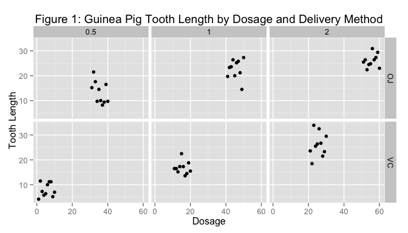

# Analyzing Guinea Pig Tooth Growth Data
Alexander Pyle, <apyle@github.com>  
December 27, 2015  

## Overview


Does delivery method and/or dosage of vitamin C affect tooth growth in guinea pigs? 
In this paper we will reviews R's 'ToothGrowth' dataset and performs the appropriate 
analysis to answer this question and identify the method and dosage, if any, that 
maximizes tooth growth.

## Data Summary


```r
# load the Guinea Pig Tooth Growth data
data(ToothGrowth)
tg <- ToothGrowth
tg <- mutate(tg, doseF = factor(dose), pig = 1:60)
```

The 'ToothGrowth' dataset included in R is the results of giving 60 guinea pigs 
dosages of vitamin C and measuring the resultant tooth growth. The dosages were 
0.5, 1.0, and 2.0 milligrams per day and was delivered either via orange juice 
or asorbic acid. The guinea pigs were separated into six groups of ten and each 
group was given the vitamin C in the same dosage and delivery method. 


```r
#tgmean <- c(mean(ToothGrowth[1:10,1]), mean(ToothGrowth[11:20,1]), mean(ToothGrowth[21:30,1]),
#            mean(ToothGrowth[31:40,1]), mean(ToothGrowth[41:50,1]), mean(ToothGrowth[51:60,1]))
gp <- ggplot(tg, aes(x = pig, y = len))
gp <- gp + geom_point()
gp <- gp + facet_grid(supp ~ doseF)
gp <- gp + labs(title = "Figure 1: Guinea Pig Tooth Length by Dosage and Delivery Method", 
                x = "Dosage", y = "Tooth Length")
gp
```



Looking at the raw data, we can observe a general trend of increasing tooth length 
with a dosage increase regardless of delivery method as shown in each row. It is 
not immediately obvious if the delivery method makes a difference. Below we will 
examine the differences with dosage and delivery method.

## Analysis


## Conclusion


## Appendix

A summary of the tooth growth data can be found at https://stat.ethz.ch/R-manual/R-patched/library/datasets/html/ToothGrowth.html. See also https://bugs.r-project.org/bugzilla3/show_bug.cgi?id=15953 for additional details on the data set.

This analysis was run with the following configuration.


```r
library(devtools)
devtools::session_info() # display environment the script was create and run in.
```

```
## Session info --------------------------------------------------------------
```

```
##  setting  value                       
##  version  R version 3.1.2 (2014-10-31)
##  system   x86_64, darwin10.8.0        
##  ui       X11                         
##  language (EN)                        
##  collate  en_US.UTF-8                 
##  tz       America/Denver
```

```
## Packages ------------------------------------------------------------------
```

```
##  package    * version  date       source                            
##  assertthat   0.1      2013-12-06 CRAN (R 3.1.0)                    
##  colorspace   1.2-4    2013-09-30 CRAN (R 3.1.0)                    
##  DBI          0.3.1    2014-09-24 CRAN (R 3.1.1)                    
##  devtools   * 1.8.0    2015-05-09 CRAN (R 3.1.3)                    
##  digest       0.6.4    2013-12-03 CRAN (R 3.1.0)                    
##  dplyr      * 0.4.1    2015-01-14 CRAN (R 3.1.2)                    
##  evaluate     0.5.5    2014-04-29 CRAN (R 3.1.0)                    
##  formatR      1.0      2014-08-25 CRAN (R 3.1.1)                    
##  ggplot2    * 1.0.0    2014-05-21 CRAN (R 3.1.0)                    
##  git2r        0.10.1   2015-05-07 CRAN (R 3.1.3)                    
##  gtable       0.1.2    2012-12-05 CRAN (R 3.1.0)                    
##  htmltools    0.2.6    2014-09-08 CRAN (R 3.1.1)                    
##  knitr        1.8      2014-11-11 CRAN (R 3.1.2)                    
##  labeling     0.3      2014-08-23 CRAN (R 3.1.1)                    
##  lazyeval     0.1.10   2015-01-02 CRAN (R 3.1.2)                    
##  magrittr     1.5      2014-11-22 CRAN (R 3.1.2)                    
##  MASS         7.3-35   2014-09-30 CRAN (R 3.1.2)                    
##  memoise      0.2.1    2014-04-22 CRAN (R 3.1.0)                    
##  munsell      0.4.2    2013-07-11 CRAN (R 3.1.0)                    
##  plyr         1.8.1    2014-02-26 CRAN (R 3.1.0)                    
##  proto        0.3-10   2012-12-22 CRAN (R 3.1.0)                    
##  Rcpp         0.11.3   2014-09-29 CRAN (R 3.1.1)                    
##  RCurl        1.95-4.3 2014-07-29 CRAN (R 3.1.1)                    
##  reshape2     1.4.1    2014-12-06 CRAN (R 3.1.2)                    
##  rmarkdown    0.3.10   2015-01-18 Github (rstudio/rmarkdown@b96214b)
##  rversions    1.0.0    2015-04-22 CRAN (R 3.1.3)                    
##  scales       0.2.4    2014-04-22 CRAN (R 3.1.0)                    
##  stringr      0.6.2    2012-12-06 CRAN (R 3.1.0)                    
##  XML          3.98-1.1 2013-06-20 CRAN (R 3.1.0)                    
##  yaml         2.1.13   2014-06-12 CRAN (R 3.1.0)
```


Now in the second portion of the class, we're going to analyze the ToothGrowth data in the R datasets package. 

* (DONE) Load the ToothGrowth data and perform some basic exploratory data analyses 
* (DONE) Provide a basic summary of the data.
* Use confidence intervals and/or hypothesis tests to compare tooth growth by supp and dose. (Only use the techniques from class, even if there's other approaches worth considering)
* State your conclusions and the assumptions needed for your conclusions. 

Some criteria that you will be evaluated on

* Did you perform an exploratory data analysis of at least a single plot or table highlighting basic features of the data?
* Did the student perform some relevant confidence intervals and/or tests?
* Were the results of the tests and/or intervals interpreted in the context of the problem correctly? 
* Did the student describe the assumptions needed for their conclusions?


Some helpful ideas:

Given that the assignment asks for hypothesis tests or confidence intervals, think like a researcher and ask yourself some questions:

    is increasing dosage associated with increases in tooth growth?
    is there any difference in tooth growth when comparing orange juice to Vitamin C tablets? 
    at a given dosage level, is there any difference in tooth growth when comparing orange juice to Vitamin C tablets?
    within a supplement type (Vitamin C or orange juice), are there any differences in tooth growth across dosage levels? 

From these questions you can develop a number of specific hypothesis tests, some of which are one-tailed tests, and others that are two-tailed tests. 
