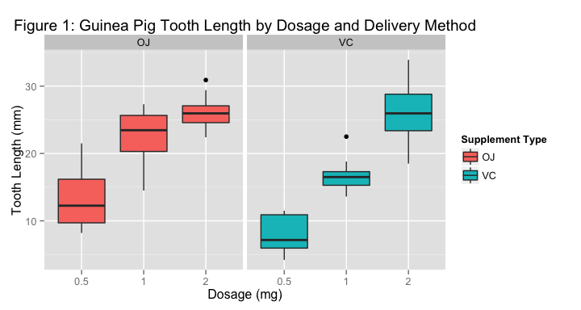

# Analyzing Guinea Pig Tooth Growth Data
Alexander Pyle, <apyle@github.com>  
December 27, 2015  

## Overview


Does delivery method and/or dosage of vitamin C affect tooth growth in guinea pigs? 
In this paper we will reviews R's 'ToothGrowth' dataset and performs the appropriate 
analysis to answer this question and identify the method and dosage, if any, that 
maximizes tooth growth.

## Data Summary


```r
# load the Guinea Pig Tooth Growth data
data(ToothGrowth)
tg <- mutate(ToothGrowth, doseF = factor(dose), pig = 1:60)
```

The 'ToothGrowth' dataset included in R is the results of giving 60 guinea pigs 
dosages of vitamin C and measuring the resultant tooth growth. The dosages were 
0.5, 1.0, and 2.0 milligrams per day and was delivered either via orange juice 
or asorbic acid. The guinea pigs were separated into six groups of ten and each 
group was given the vitamin C in the same dosage and delivery method. 


```r
gp <- ggplot(tg, aes(x = pig, y = len))
gp <- gp + geom_point() + facet_grid(supp ~ doseF)
gp <- gp + labs(title = "Figure 1: Guinea Pig Tooth Length by Dosage and Delivery Method", 
                x = "Dosage", y = "Tooth Length")
gp
```



Looking at the raw data, we can observe a general trend of increasing tooth length 
with a dosage increase regardless of delivery method as shown in each row. It is 
not immediately obvious if the delivery method makes a difference. Below we will 
examine the differences with dosage and delivery method.

## Analysis

These analysis are based on the following assumptions. First, we are assuming that 
the data are independent and identically distributed (iid) values. We will also 
assume that the data distributions are not skewed; reviewing the data in the plot 
above doesn't suggest that the data is order of magnatudes different where we would 
want to pursue a logirithmic approach. The analysis also assumes that the variances 
between the different data groups is equal. 


```r
# Compare the delivery method for 0.5 dosages
test1 <- subset(tg, doseF %in% (0.5))
r1 <- t.test(len ~ supp, data=test1, paired=FALSE, var.equal=TRUE)
```

For our first test, we will see if there is a difference in delivery method at the 
0.5 mg daily dosage. Based on our test above, we find the p-value of the test is 
0.0053 which suggests there is high likelihood that the means 
are different.


```r
# Compare the delivery method for 1 mg dosages
test2 <- subset(tg, doseF %in% (1))
r2 <- t.test(len ~ supp, data=test2, paired=FALSE, var.equal=TRUE)
```

Like the first test, we will see if there is a difference in delivery methods, but 
at the 1 mg daily dosage. Based on our test above, we find the p-value of the test 
is 7.8\times 10^{-4} which suggests there is high likelihood that the means 
are different, even more than at the 0.5 mg dosage. 


```r
# Compare the delivery method for 1 mg dosages
test3 <- subset(tg, doseF %in% (2))
r3 <- t.test(len ~ supp, data=test3, paired=FALSE, var.equal=TRUE)
```

For the third test, we will see if there is a difference in delivery methods at 
the 2 mg daily dosage. Based on our test above, we find the p-value of the test 
is 0.96371 which suggests there is high likelihood that the 
means are the same, meaning that the differences that we saw at the 0.5 mg and 
1.0 mg dosages no longer applies at the 2.0 mg daily dosage. 


## Conclusion


Based on the findings above, we can state that the increase in dosage does have 
an impact on guinea pig tooth growth regardless of delivery method. The analysis 
also supports the finding that for dosages up to a 2 milligram per day, the orange 
juice delivery method promotes more tooth growth. At 2 mg/day, however, there is 
no statistical difference between delivery by orange juice or asorbic acid.

## Appendix

A summary of the tooth growth data can be found at https://stat.ethz.ch/R-manual/R-patched/library/datasets/html/ToothGrowth.html. 
See also https://bugs.r-project.org/bugzilla3/show_bug.cgi?id=15953 for additional details on the data set.

This analysis was run with the following configuration.


```r
library(devtools)
devtools::session_info() # display environment the script was create and run in.
```

```
## Session info --------------------------------------------------------------
```

```
##  setting  value                       
##  version  R version 3.1.2 (2014-10-31)
##  system   x86_64, darwin10.8.0        
##  ui       X11                         
##  language (EN)                        
##  collate  en_US.UTF-8                 
##  tz       America/Denver
```

```
## Packages ------------------------------------------------------------------
```

```
##  package    * version  date       source                            
##  assertthat   0.1      2013-12-06 CRAN (R 3.1.0)                    
##  colorspace   1.2-4    2013-09-30 CRAN (R 3.1.0)                    
##  DBI          0.3.1    2014-09-24 CRAN (R 3.1.1)                    
##  devtools   * 1.8.0    2015-05-09 CRAN (R 3.1.3)                    
##  digest       0.6.4    2013-12-03 CRAN (R 3.1.0)                    
##  dplyr      * 0.4.1    2015-01-14 CRAN (R 3.1.2)                    
##  evaluate     0.5.5    2014-04-29 CRAN (R 3.1.0)                    
##  formatR      1.0      2014-08-25 CRAN (R 3.1.1)                    
##  ggplot2    * 1.0.0    2014-05-21 CRAN (R 3.1.0)                    
##  git2r        0.10.1   2015-05-07 CRAN (R 3.1.3)                    
##  gtable       0.1.2    2012-12-05 CRAN (R 3.1.0)                    
##  htmltools    0.2.6    2014-09-08 CRAN (R 3.1.1)                    
##  knitr        1.8      2014-11-11 CRAN (R 3.1.2)                    
##  labeling     0.3      2014-08-23 CRAN (R 3.1.1)                    
##  lazyeval     0.1.10   2015-01-02 CRAN (R 3.1.2)                    
##  magrittr     1.5      2014-11-22 CRAN (R 3.1.2)                    
##  MASS         7.3-35   2014-09-30 CRAN (R 3.1.2)                    
##  memoise      0.2.1    2014-04-22 CRAN (R 3.1.0)                    
##  munsell      0.4.2    2013-07-11 CRAN (R 3.1.0)                    
##  plyr         1.8.1    2014-02-26 CRAN (R 3.1.0)                    
##  proto        0.3-10   2012-12-22 CRAN (R 3.1.0)                    
##  Rcpp         0.11.3   2014-09-29 CRAN (R 3.1.1)                    
##  RCurl        1.95-4.3 2014-07-29 CRAN (R 3.1.1)                    
##  reshape2     1.4.1    2014-12-06 CRAN (R 3.1.2)                    
##  rmarkdown    0.3.10   2015-01-18 Github (rstudio/rmarkdown@b96214b)
##  rversions    1.0.0    2015-04-22 CRAN (R 3.1.3)                    
##  scales       0.2.4    2014-04-22 CRAN (R 3.1.0)                    
##  stringr      0.6.2    2012-12-06 CRAN (R 3.1.0)                    
##  XML          3.98-1.1 2013-06-20 CRAN (R 3.1.0)                    
##  yaml         2.1.13   2014-06-12 CRAN (R 3.1.0)
```

